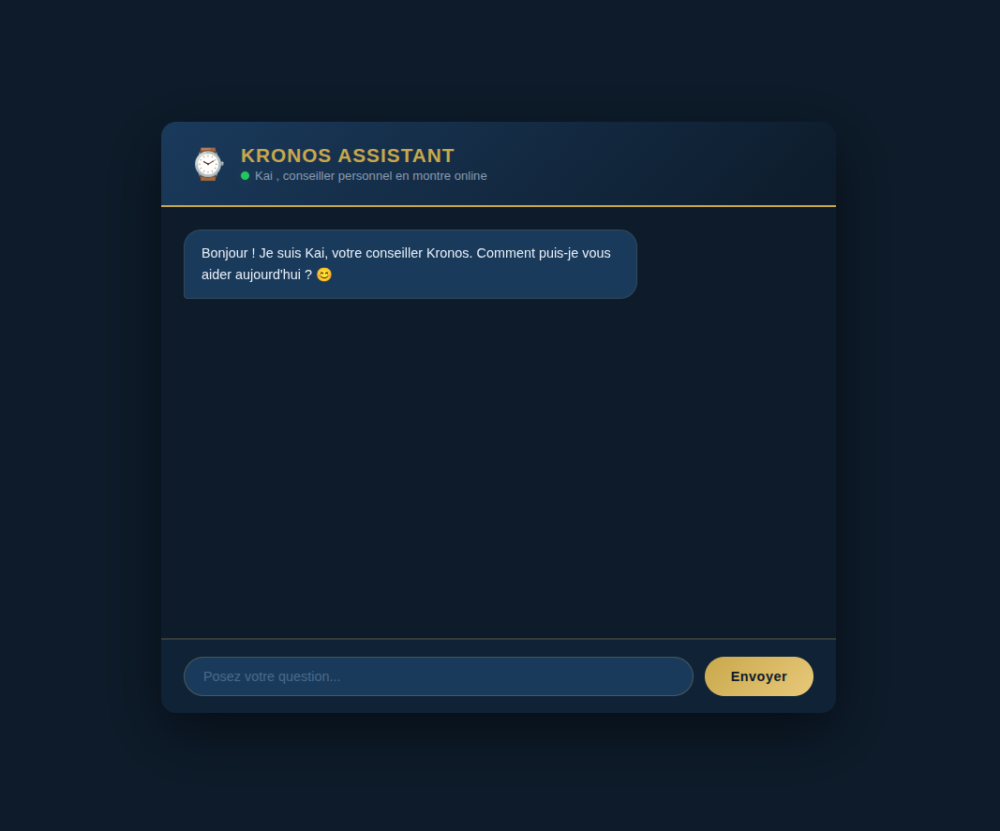

# Kronos Assistant — E-commerce Chatbot

An AI-powered customer service chatbot for a premium watch boutique, built with Flask and the Groq API.



## Features

- Conversational product advisor powered by Llama 3.3 via Groq
- Catalog of 50 real watch brands (Rolex, Omega, Seiko, Casio, and more)
- Smart WhatsApp handoff — only suggested when the customer shows buying intent
- Animated chat interface with typing indicator and message slide-in effects
- Fully responsive, gold & navy blue design

## Tech Stack

Python, Flask, Groq API (Llama 3.3-70b), HTML/CSS/JS

## Setup

```bash
git clone https://github.com/Bee07-DD/courses_projects.git
cd courses_projects/chatbot-ecommerce
python3 -m venv venv
source venv/bin/activate
pip install -r requirements.txt
```

Create a `.env` file:

```
GROQ_API_KEY=your_groq_api_key
```

```bash
python app.py
```

Open `http://127.0.0.1:5000`

## Project Context

Built as a prototype for the Kronos project , a watch e-commerce platform targeting the African market. The chatbot is designed to guide customers from product discovery to purchase, with a natural and non-intrusive conversation flow.