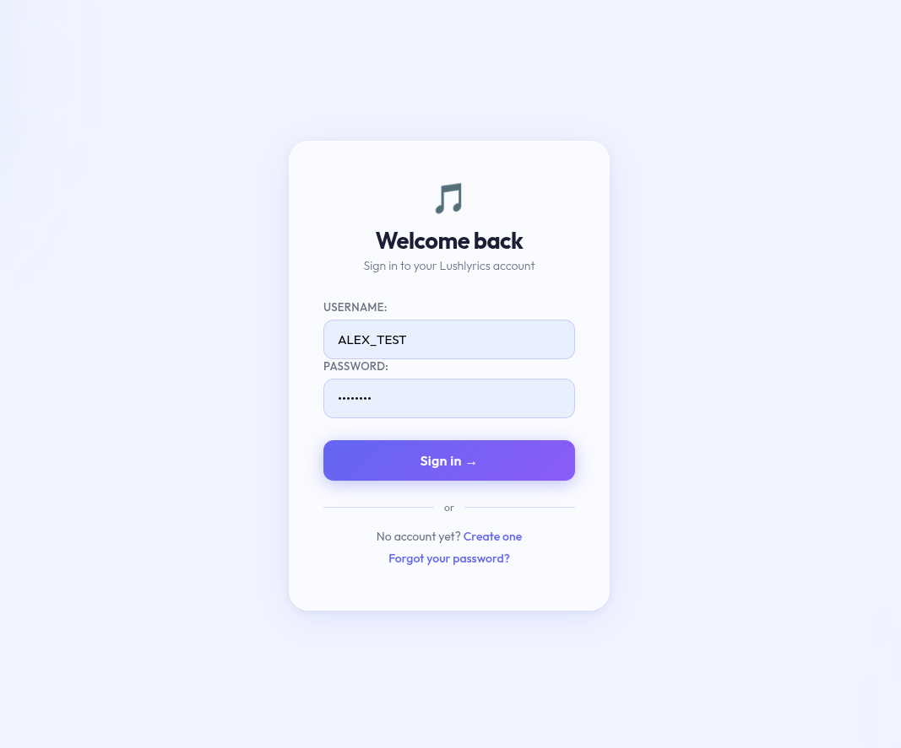
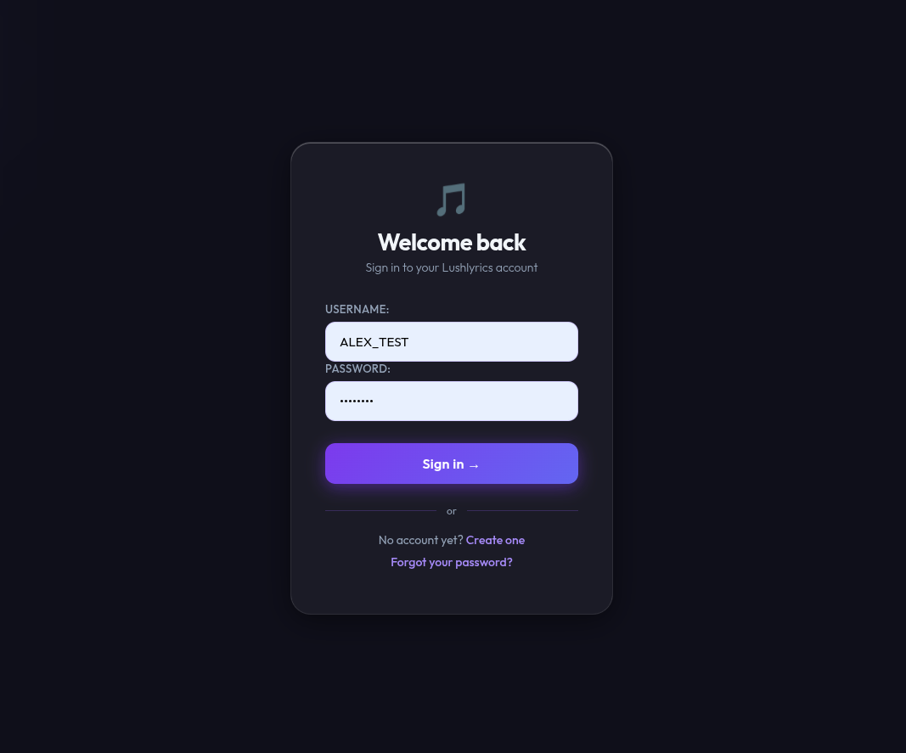

# Django Login System

A full-featured user authentication system built with Django, developed as part of a Coursera guided project.

## Preview

| Light Mode | Dark Mode |
|------------|-----------|
|  |  |

## Features

- User registration with email
- Login / Logout
- Protected dashboard (authentication required)
- Password recovery via OTP sent to Gmail
- Glassmorphism UI with dark/light mode toggle

## Tech Stack

Python, Django, SQLite, HTML/CSS/JS

## Setup

```bash
git clone https://github.com/Bee07-DD/courses_projects.git
cd courses_projects/django-login
python3 -m venv venv
source venv/bin/activate
pip install -r requirements.txt
```

Create a `.env` file at the root with:

```
SECRET_KEY=your_secret_key
GMAIL_USER=your_email@gmail.com
GMAIL_APP_PASSWORD=your_app_password
```

```bash
python manage.py migrate
python manage.py runserver
```

Open `http://127.0.0.1:8000`